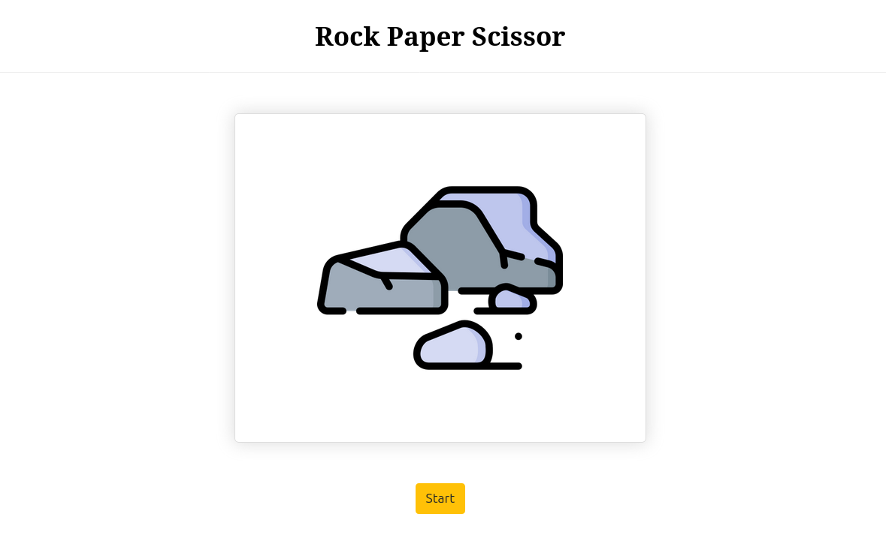

# ✂️ Rock–Paper–Scissor

A simple Rock–Paper–Scissor game using JavaScript, bundled with Webpack, and ready to run with Docker.



---

## 🐳 Run with Docker

### Step 1: Clone the Repo

```bash
git clone https://github.com/a-sabagh/rock-paper-scissor.git
cd rock-paper-scissor
```

## Step 2: Build the Docker Image

```bash
docker compose up -d
```

Once the container is running, open your browser and go to:

http://localhost:8088/

Enjoy playing the game!
